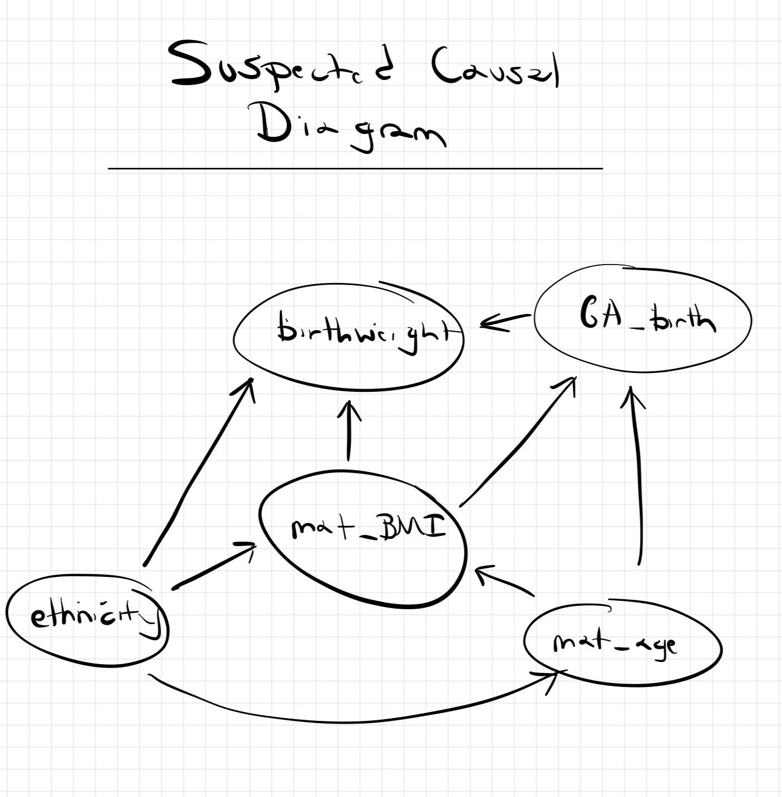

# STATS 763: Lab 1
### Tarin Eccleston

```{r}
library(tidyverse)
```

```{r}
load("../data/birthweight.RData")
bw %>% str
```
### Q1)
#### Suspected Causal Diagram

```{r}

```


#### No Adjustments

```{r}
birthWeight_non_adjustment_model <- lm(birthWeight ~ mat_BMI, data = bw)
summary(birthWeight_non_adjustment_model)
```

```{r}
xx <- seq(min(bw$mat_BMI), max(bw$mat_BMI), length.out = 100)
yy <- predict(birthWeight_non_adjustment_model, newdata = data.frame(mat_BMI = xx), type = 'response')
{
plot(birthWeight ~ mat_BMI, data = bw)
lines(yy ~ xx)
}
```

- For each unit increase of maternal BMI, there is an increase of 16.6g of baby birth weight. The estimated difference in birth weight associated with a change in BMI from 25 to 30, is 83.1g.
- Model appears to fit okay however there are possibly other confounders to include.

#### Adjusting for maternal ethnicity

```{r}
birthWeight_ethnicity_model <- lm(birthWeight ~ mat_BMI + ethnicity, data = bw)
summary(birthWeight_ethnicity_model)
```

```{r}
ggplot(bw, aes(x = mat_BMI, y = birthWeight)) +
  geom_point() +
  geom_smooth(method = "lm", se = FALSE) +
  facet_wrap(~ ethnicity) +
  labs(title = "Birthweight vs Maternal BMI by Ethnicity",
       x = "Maternal BMI",
       y = "Birthweight (g)") +
  theme_minimal()
```

- The pivot ethnicity class is taken as Asian.
- Maternal ethnicity as European results in an increase of 236g of baby birth weight compared to Asian.
- Material ethnicity as Indian results in a decrease of 28g of baby birth weight compared to Asian (East Asian?).
- A decrease (change) in maternal BMI coefficient shows when we adjusted for ethnicity in our model, this means that there is an added effect of adjusting for ethnicity.
- This could mean that ethnicity is a confounder to maternal BMI and baby birth weight.
- The estimated difference in birth weight associated with a change in BMI from 25 to 30, is 65.2g.

#### Adjusting for maternal ethnicity and maternal age

```{r}
birthWeight_ethnicity_mat_age_model <- lm(birthWeight ~ mat_BMI + ethnicity + mat_age_deliv, data = bw)
summary(birthWeight_ethnicity_mat_age_model)
```

- Coefficients for material BMI do not change much from the simpler model with just the maternal ethnicity adjustment when we add in maternal age. This could mean that the effect of age is explained by ethnicity, or age has no added effect on other covariates.
- For every increase in maternal age at delivery, there is a 2.4g decrease in baby birth weight. The estimated difference in birth weight associated with a change in BMI from 25 to 30, is 65.8g.

#### Adjusting for all a priori suspected confounders (maternal age, ethnicity, and gestational age at birth)

```{r}
birthWeight_ethnicity_mat_age_GA_birth_model <- lm(birthWeight ~ mat_BMI + ethnicity + mat_age_deliv + GA_birth, data = bw)
summary(birthWeight_ethnicity_mat_age_GA_birth_model)
```

- There seems to be a change of 1.25g per unit increase of maternal BMI when we adjust for all a priori suspected confounders compared to adjusting for just ethnicity. I'm unsure whether this is significant.
- A unit increase of 1 week of gestational age at birth results in an increase of 144g of birthweight. The estimated difference in birth weight associated with a change in BMI from 25 to 30, is 75.25g.

### Q2)

- You can't. In order for a covariate to be a confounder to another covariate, cause needs to proceed effect. In this case, the gestational age at birth does not proceed the maternal BMI.
