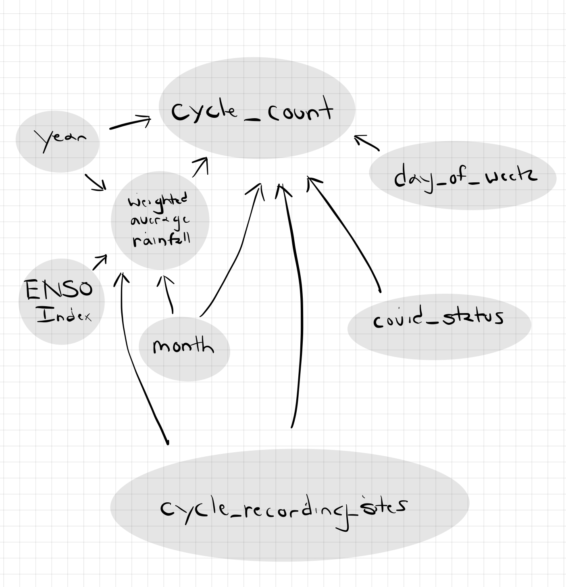

# STATS 763: Assignment 1: Cycling in the Rain
### Tarin Eccleston
### 07/08/2024

```{r results='hide', warning=FALSE, message=FALSE, error=FALSE, echo=FALSE}
library(tidyverse)
library(geosphere)
library(lubridate)
```

#### Data Manipulation

Based on the brief, we would like these columns in our dataframe for modelling:

- date (used for reference)
- cycle_count
- weighted_average_rainfall
- cycle_recording_sites
- covid_status
- year
- month
- day_of_week

##### Read Data

```{r results='hide', warning=FALSE, message=FALSE, error=FALSE}
auckland_cycle_2018 <- read_csv("data/aucklandcyclists2018.csv")
auckland_cycle_2019 <- read_csv("data/aucklandcyclists2019.csv")
auckland_cycle_2020 <- read_csv("data/aucklandcyclists2020.csv")
auckland_cycle_2021 <- read_csv("data/aucklandcyclists2021.csv")
auckland_cycle_2022 <- read_csv("data/aucklandcyclists2022.csv")

monitoring_locations <- read.csv("data/monitoringlocations.csv")

daily_rainfall <- read.csv("data/daily-rainfall-at-30-sites-1960-to-2022.csv")
daily_rainfall_data_dict <- read.csv("data/daily-rainfall-at-30-sites-1960-to-2022-dictionary.csv")
```

##### Standardise Date Format

We need all date formats to be in YYYY-MM-DD, and as date objects.

```{r}
auckland_cycle_2018 <- auckland_cycle_2018 %>%
  mutate(date = as.Date(Date, format = "%Y-%m-%d")) %>%
  select(-Date)

auckland_cycle_2019 <- auckland_cycle_2019 %>%
  mutate(date = dmy(str_remove(Date, "^[A-Za-z]+,\\s*"))) %>%
  mutate(date = as.Date(date, format = "%Y-%m-%d")) %>%
  select(-Date)

auckland_cycle_2020 <- auckland_cycle_2020 %>%
  mutate(date = dmy(str_remove(Date, "^[A-Za-z]+\\s+"))) %>%
  mutate(date = as.Date(date, format = "%Y-%m-%d")) %>%
  select(-Date)

auckland_cycle_2021 <- auckland_cycle_2021 %>%
  mutate(date = as.Date(Date, format = "%Y-%m-%d")) %>%
  select(-Date)

auckland_cycle_2022 <- auckland_cycle_2022 %>%
  mutate(date = as.Date(Date, format = "%Y-%m-%d")) %>%
  select(-Date)
```

##### Pivot data and Merge

```{r}
auckland_cycle_2018 <- auckland_cycle_2018 %>%
  pivot_longer(cols = -date, names_to = "cycle_recording_site", values_to = "cycle_count") %>%
  drop_na(cycle_count)
  round(cycle_count)

auckland_cycle_2019 <- auckland_cycle_2019 %>%
  pivot_longer(cols = -date, names_to = "cycle_recording_site", values_to = "cycle_count") %>%
  drop_na(cycle_count)

auckland_cycle_2020 <- auckland_cycle_2020 %>%
  pivot_longer(cols = -date, names_to = "cycle_recording_site", values_to = "cycle_count") %>%
  drop_na(cycle_count)

auckland_cycle_2021 <- auckland_cycle_2021 %>%
  pivot_longer(cols = -date, names_to = "cycle_recording_site", values_to = "cycle_count") %>%
  drop_na(cycle_count)

auckland_cycle_2022 <- auckland_cycle_2022 %>%
  pivot_longer(cols = -date, names_to = "cycle_recording_site", values_to = "cycle_count") %>%
  drop_na(cycle_count)

auckland_cycle <- rbind(auckland_cycle_2018, auckland_cycle_2019, auckland_cycle_2020, auckland_cycle_2021, auckland_cycle_2022)

auckland_cycle <- auckland_cycle %>%
  mutate(cycle_count = round(cycle_count))
```

We drop all NAs. It would be difficult to impute, and we already have quite a bit of data. Though the missing data could have an effect on biasing our estimates.

I'm unsure why we have non-integer counts for cycle counts so I rounded all cycle counds.

##### Filter for important rainfall data

Two of the rainfall monitoring locations are relevant to Auckland: "Auckland (Auckland)", close to the airport, and "Whangaparāoa (Auckland)".

We only need need rainfall data corresponding to cycling data between 2018-01-01 and 2022-12-31.

```{r}
daily_rainfall_auckland <- daily_rainfall %>%
  filter(site == "Auckland (Auckland)") %>%
  mutate(date = as.Date(date, format = "%Y-%m-%d")) %>%
  filter(date >= as.Date("2018-01-01"))

daily_rainfall_whangaparaoa <- daily_rainfall %>%
  filter(site == "Whangaparāoa (Auckland)") %>%
  mutate(date = as.Date(date, format = "%Y-%m-%d")) %>%
  filter(date >= as.Date("2018-01-01"))
```

##### Get Distances between Rainfall Stations and Cycle Recording Sites

```{r}
auckland_rainfall_station_coordinates <- data_frame(
  lat = -37.00813,
  lon = 174.7887
)

whangaparaoa_rainfall_station_coordinates <- data_frame(
  lat = -36.606,
  lon = 174.835
)

rainfall_stations_to_cycle_recording_sites <- data_frame(cycle_recording_site = monitoring_locations$Location)

rainfall_stations_to_cycle_recording_sites <- rainfall_stations_to_cycle_recording_sites %>%
  mutate(distance_to_auckland = pmap_dbl(
    list(lat = monitoring_locations$Latitude, lon = monitoring_locations$Longitude),
    ~ distHaversine(c(..2, ..1), c(auckland_rainfall_station_coordinates$lon, auckland_rainfall_station_coordinates$lat))
  )) %>%
  mutate(distance_to_whangaparaoa = pmap_dbl(
    list(lat = monitoring_locations$Latitude, lon = monitoring_locations$Longitude),
    ~ distHaversine(c(..2, ..1), c(whangaparaoa_rainfall_station_coordinates$lon, whangaparaoa_rainfall_station_coordinates$lat))
  ))
```

##### Calculate Weighted Average Rainfall by Relative Distances between Rainfall Stations and Cycle Recording Sites

```{r}
auckland_cycle <- auckland_cycle %>%
  left_join(rainfall_stations_to_cycle_recording_sites, by = "cycle_recording_site") %>%
  left_join(daily_rainfall_auckland %>% select(date, rainfall) %>% rename(rainfall_auckland = rainfall), by = "date") %>%
  left_join(daily_rainfall_whangaparaoa %>% select(date, rainfall) %>% rename(rainfall_whangaparaoa = rainfall), by = "date") %>%
  mutate(weighted_average_rainfall = (rainfall_auckland / distance_to_auckland + rainfall_whangaparaoa / distance_to_whangaparaoa) /
                        (1 / distance_to_auckland + 1 / distance_to_whangaparaoa)) %>%
  select(-c(distance_to_auckland, distance_to_whangaparaoa, rainfall_auckland, rainfall_whangaparaoa))
```

Another approach would be to find the closest rainfall station and use those measurements for that day at that cycle recording site. However, I believe using the weighted average between the two rainfall stations in Auckland weighted by their relative distances to the cycle recording sites is the best approach as it balances out bias created from having rainfall measurements taken at a vastly different location to the cycle recording sites.

##### Find Day of the Week, Month and Year

```{r}
auckland_cycle <- auckland_cycle %>%
  mutate(day_of_week = as.factor(weekdays(date))) %>%
  mutate(day_of_week = factor(day_of_week, levels = c("Monday", "Tuesday", "Wednesday", "Thursday", "Friday", "Saturday", "Sunday"))) %>%
  mutate(month = factor(month(date), labels = month.name)) %>%
  mutate(year = as.factor(year(date)))
```

These covariates should be sufficient to account for seasonality (in addition to covid_status).

##### Set Covid Status

```{r}
auckland_cycle <- auckland_cycle %>%
  mutate(covid_status = case_when(
    date >= as.Date("2018-01-01") & date <= as.Date("2020-03-24") ~ "pre-covid",
    date >= as.Date("2020-03-25") & date <= as.Date("2020-04-27") ~ "level-4-lockdown",
    date >= as.Date("2020-04-28") & date <= as.Date("2020-05-10") ~ "level-3-lockdown",
    date >= as.Date("2020-05-11") & date <= as.Date("2020-05-24") ~ "level-2-lockdown",
    date >= as.Date("2020-05-25") & date <= as.Date("2020-06-07") ~ "level-1-lockdown",
    date >= as.Date("2020-06-08") & date <= as.Date("2020-08-10") ~ "inter-lockdown",
    date >= as.Date("2020-08-11") & date <= as.Date("2020-08-29") ~ "level-3-lockdown",
    date >= as.Date("2020-08-30") & date <= as.Date("2020-09-22") ~ "level-2.5-lockdown",
    date >= as.Date("2020-09-23") & date <= as.Date("2020-10-06") ~ "level-2-lockdown",
    date >= as.Date("2020-10-07") & date <= as.Date("2021-02-13") ~ "inter-lockdown",
    date >= as.Date("2021-02-14") & date <= as.Date("2021-03-06") ~ "level-3-lockdown",
    date >= as.Date("2021-03-07") & date <= as.Date("2021-08-16") ~ "inter-lockdown",
    date >= as.Date("2021-08-17") & date <= as.Date("2021-09-20") ~ "level-4-lockdown",
    date >= as.Date("2021-09-21") & date <= as.Date("2021-12-01") ~ "level-3-lockdown",
    date >= as.Date("2021-12-02") & date <= as.Date("2021-12-29") ~ "traffic-red-lockdown",
    date >= as.Date("2021-12-30") & date <= as.Date("2022-09-11") ~ "traffic-orange-lockdown",
    date >= as.Date("2022-09-12") & date <= as.Date("2022-12-31") ~ "post-covid",
  ))
```

I obtained lockdown and restriction dates from policycommons.ac.nz.

#### Exploratory Analysis

##### Causal Diagram

```{r}

```

- Question: day_of_week, covid_status accounts for some variation in cycle_count right?
- Question: are mediators bad?

##### Bi-variate Plots

These plots show direct relationships between the concerning covariate with direct effects on cycle_count and confounders of rainfall. These are all important to include in our model.

```{r}
ggplot(auckland_cycle, aes(x = cycle_recording_site, y = cycle_count)) +
  geom_bar(stat = "identity") +
  labs(title = "Cycle Count vs Cycle Recording Site",
       x = "Cycle Recording Site",
       y = "Total Cycle Count") +
  theme_minimal() +
  theme(axis.text.x = element_text(angle = 90, hjust = 1, vjust = 0.5)) +
  scale_y_continuous(labels = function(x) format(x, big.mark = ",", scientific = FALSE))
```

There is non-uniformity between total cycle count vs cycle recording site. Certain cycle recording sites such as NW Cycleway Kingslandm, Quay St. Eco Display Classic, and Quay St. Spark Arena have more cycle counts across the dataset compared to other recording sites. There seems be an effect of rural and urbanised recording sites on total cycle count, with urbanised sites being more popular. We include cycle recording site in our model.

```{r}
ggplot(auckland_cycle, aes(x = year, y = cycle_count)) +
  geom_bar(stat = "identity") +
  labs(title = "Total Cycle Count vs Year",
       x = "Year",
       y = "Total Cycle Count") +
  theme_minimal() +
  theme(axis.text.x = element_text(angle = 0, hjust = 0.5, vjust = 0.5)) +
  scale_y_continuous(labels = function(x) format(x, big.mark = ",", scientific = FALSE))
```

There was noticeably more cycle counts in 2019. There appears to be an overall downward trend on cycling counts across the years. People often cycle for leisure or transport (usually to and from work). Since Covid-19, there has been a rise of hydrid/remote work, which in combination with lockdowns, could explain the downward trend in cycle counts. We include year in our model.

```{r}
ggplot(auckland_cycle, aes(x = month, y = cycle_count)) +
  geom_bar(stat = "identity") +
  labs(title = "Total Cycle Count vs Month",
       x = "Month",
       y = "Total Cycle Count") +
  theme_minimal() +
  theme(axis.text.x = element_text(angle = 90, hjust = 1, vjust = 0.5)) +
  scale_y_continuous(labels = function(x) format(x, big.mark = ",", scientific = FALSE))
```

There appears to be seasonality - the colder months (June, July, and August) appear to have less cycle total counts compared to warmer months (December, January, February, March). There are unusually low total cycle counts in December, this could be due to the Christmas Holidays. Note: mobility restrictions during lockdowns in 2020-2021 which could effect seasonality. We include month in our model.

It would be interesting to see the trend and seasonilty across all dates. Although the dates will not be used in our model.

```{r}
date_breaks <- seq(from = as.Date("2015-01-01"), to = as.Date("2022-12-01"), by = "1 year")

ggplot(auckland_cycle, aes(x = date, y = cycle_count)) +
  geom_bar(stat = "identity") +
  labs(title = "Total Cycle Count vs Date",
       x = "Date",
       y = "Total Cycle Count") +
  theme_minimal() +
  theme(axis.text.x = element_text(angle = 0, hjust = 0, vjust = 0.5)) +
  scale_y_continuous(labels = function(x) format(x, big.mark = ",", scientific = FALSE)) +
  scale_x_date(date_labels = "%Y-%m", breaks = date_breaks)
```

The plot of total cycle counts vs date supports the seasonality seen between month and total cycle count, and downward trend seen between year and total cycle count.

```{r}
ggplot(auckland_cycle, aes(x = day_of_week, y = cycle_count)) +
  geom_bar(stat = "identity") +
  labs(title = "Total Cycle Count vs Day of Week",
       x = "Day of Week",
       y = "Total Cycle Count") +
  theme_minimal() +
  theme(axis.text.x = element_text(angle = 90, hjust = 1, vjust = 0.5)) +
  scale_y_continuous(labels = function(x) format(x, big.mark = ",", scientific = FALSE))
```

There appears to be seasonality - the middle of the weekday (Tuesday and Wednesday) have the highest total cycle counts, whereas the weekend (Saturday and Sunday) have the lowest total cycle counts. This supports the assumption that people often cycle for leisure or transport (usually to and from work), the middle of the weekday being when people are most likely working. We include day of week in our model.

```{r}
ggplot(auckland_cycle, aes(x = covid_status, y = cycle_count)) +
  geom_jitter(width = 0.2, height = 0, alpha = 0.6) +
  labs(title = "Cycle Count vs Covid Status",
       x = "Covid Status",
       y = "Cycle Count") +
  theme_minimal() +
  theme(axis.text.x = element_text(angle = 90, hjust = 1, vjust = 0.5)) +
  scale_y_continuous(labels = function(x) format(x, big.mark = ",", scientific = FALSE))
```

- Uh what is happening... might need to reverse engineer this shit.
- Def colour code between lockdown periods

```{r}
ggplot(auckland_cycle, aes(x = year, y = weighted_average_rainfall)) +
  geom_jitter(width = 0.4, height = 0, alpha = 0.6) +
  labs(title = "Weighted Average Rainfall vs Year",
       x = "Year",
       y = "Weighted Average Rainfall (mm)") +
  theme_minimal() +
  theme(axis.text.x = element_text(angle = 0, hjust = 0.5, vjust = 0.5)) +
  scale_y_continuous(labels = function(x) format(x, big.mark = ",", scientific = FALSE))
```

There appears to be some seasonality of year on rainfall, this could be due to ENSO. We include year in our model as a confounder for rainfall on cycle count.

Appears to be weird bands in the measurements, maybe due to instrument resolution and sensitivity.

```{r}
season_colors <- c("Summer" = "#FF8C00", "Autumn" = "#FFD700", "Winter" = "#1E90FF", "Spring" = "#32CD32")

auckland_cycle <- auckland_cycle %>%
  mutate(season = case_when(
    month %in% c("December", "January", "February") ~ "Summer",
    month %in% c("March", "April", "May") ~ "Autumn",
    month %in% c("June", "July", "August") ~ "Winter",
    month %in% c("September", "October", "November") ~ "Spring"
  ))

ggplot(auckland_cycle, aes(x = month, y = weighted_average_rainfall, color = season)) +
  geom_jitter(width = 0.4, height = 0, alpha = 0.6) +
  labs(title = "Weighted Average Rainfall vs Month",
       x = "Month",
       y = "Weighted Average Rainfall (mm)",
       color = "Season") +
  scale_color_manual(values = season_colors) +
  theme_minimal() +
  theme(axis.text.x = element_text(angle = 90, hjust = 1, vjust = 0.5)) +
  scale_y_continuous(labels = function(x) format(x, big.mark = ",", scientific = FALSE))
```

There appears to be seasonality of month on rainfall - winter months (June, July, and August) having the highest rainfall, followed by Autumn months (March, April, and May), Summer months (December, January, and February), and Spring months (September, October, and November) with the lowest rainfall. We include month in as a confounder for rainfall on cycle count.

```{r}
ggplot(auckland_cycle, aes(x = cycle_recording_site, y = weighted_average_rainfall)) +
  geom_jitter(width = 0.4, height = 0, alpha = 0.6, color = "grey") +
  labs(title = "Weighted Average Rainfall vs Year",
       x = "Year",
       y = "Weighted Average Rainfall (mm)") +
  theme_minimal() +
  theme(axis.text.x = element_text(angle = 90, hjust = 1, vjust = 0.5)) +
  scale_y_continuous(labels = function(x) format(x, big.mark = ",", scientific = FALSE))
```

There is uniformity between rainfall vs cycle recording site. However some sites (GI to Tamaki Dr. Section 2, Matakana, New Lynn to Avondale SUP, and Quay St. Totem UZELT) appear to have much lower rainfalls than all other sites, this is possibly due to the missing values in the data. 

##### Modelling

```{r}
cycle_count_model <- glm(cycle_count ~ weighted_average_rainfall + day_of_week + month + year + cycle_recording_site, family = poisson(), data = auckland_cycle)
```

potentially look at neg bin

round cycle counts as some are non ints

only care about est for rainfall

plot the residuals, code pot in bens notes

```{r}
summary(cycle_count_model)
```
```{r}
ac %>% str
```


#### Discussion

NOTE: only show important outputs / code

##### Interactions

I did not include interactions, and stuck a model with many covariates but simple order. An extension of this investigation would be to explore interaction effects between certain covariates and their effect on cycle count.

##### Seasonality

Although I included the ENSO index in the causal diagram and is a confounder for rainfall, I decided not to investigate this further in the model, as I believe the El Nino / El Nina effects are explained by the year covariate.

##### Lockdowns


##### Other Weather Covariates (Not Included in Analysis)

Rainfall is a good indicator, of weather conditions favorable for cycling, however we should also consider temperate and wind speed in our model, that may serve to decrease the residual variance. However I'm not well versed in climate science, and adjusting for these other covariates might introduce mediator in our model.

##### Weekend Effect

Based on my research, it seems like there is a more noticeable effect on rainfall between weekdays and weekends in very large cities. I've included this as a confounder of rainfall in my causal DAG. The weekend effect should be sufficiently covered in the day_of_week covariate. 

##### ENSO Index

I decided not to use the ENSO index as I believe this is already explained by the year covariate.

