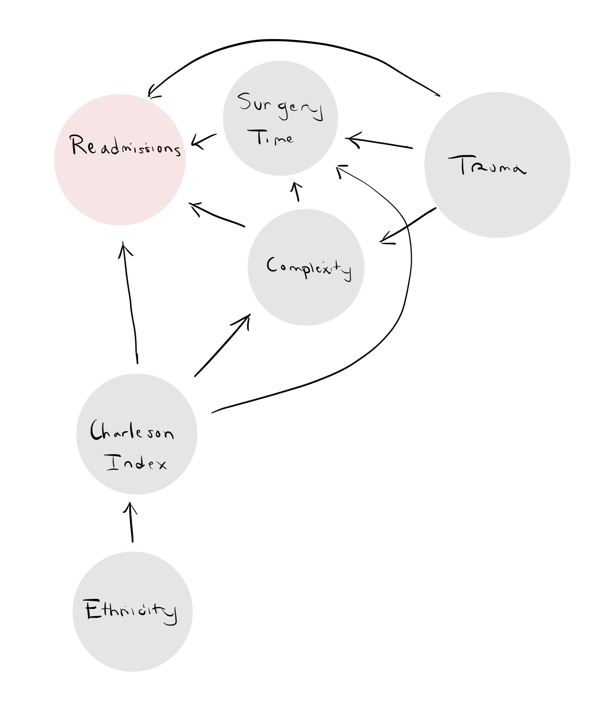

## STATS 763: Assignment 2: Spinal surgery and readmission
#### Tarin Eccleston
#### 23/08/2024

We are interested in the causal effect of the duration of the surgery (Surgery time) on the probability of being readmitted within 30 days. The variable Re-admissions indicates the number of re-admissions within this period.

Assume that confounding is reasonably well alleviated by adjusting for Ethnicity, Trauma, Surgical complexity and Charlson Index (co-morbidity index) in models relating Surgery time to readmission within 30 days.

Clean the data, limiting yourself to the variables being considered.

```{r results='hide', warning=FALSE, message=FALSE, error=FALSE, echo=FALSE}
library(tidyverse)
library(lubridate)
library(stringr)
library(broom)
library(sandwich)
```

### Data Manipulation

Based on the brief, we would like these columns in our dataframe for modelling:

- Re-admission (outcome)
- Surgery time (exposure)
___________________________ (confounders)
- Ethnicity 
- Trauma
- Surgical complexity
- Charlson Index (co-morbidity index)

```{r results='hide', warning=FALSE, message=FALSE, error=FALSE, echo=FALSE}
spinal_surg <- read_csv("data/spinal_surgery.csv")
```

#### Remove Missing Values

Only select covariates of interest including the ID. Rename 

Remove observations with missing values (NA) for the exposure, outcome or confounders, but provide a clear account of the missing values in these variables.

The IDs of the missing values are shown below.

```{r}
spinal_surg <- spinal_surg %>%
  dplyr::select("ID", "Readmissions", "Surgery time", "Ethnicity", "Trauma", "Surgical complexity", "Charlson Index") %>%
  rename(
    Surgery_Time = `Surgery time`,
    Surgical_Complexity = `Surgical complexity`,
    Charlson_Index = `Charlson Index`
  )

spinal_surg_remove_na <- spinal_surg %>%
  drop_na()

removed_observations_IDs <- spinal_surg %>%
  filter(!ID %in% spinal_surg_remove_na$ID) %>%
  dplyr::select(ID)

spinal_surg <- spinal_surg_remove_na

removed_observations_IDs
```

Only 17 out of the 631 observations have missing values, this is quite insignificant. We decided not to impute these missing values.

#### Rescale Surgery Time

The surgery time is originally in HH:MM format, we r-scaled to the number of hours (numeric), as this will provide a sensible interpretation for the coefficient for surgery time. For example, 07:30 would be re-scaled to 7.5 hours.

```{r}
spinal_surg <- spinal_surg %>%
  mutate(Surgery_Time = period_to_seconds(hms(Surgery_Time)) / 3600)
```

#### Create Binary Variable for Readmission

Since re-admissions outcome is a count of number of readmission in 30 days, we are only interested if there are 1 or more re-admissions. Set re-admissions to 1 is there are 1 or more re-admissions, and 0 is there are none. We are only interested in a binary outcome as suggested by the brief.

```{r}
spinal_surg <- spinal_surg %>%
  mutate(Readmitted = ifelse(Readmissions >= 1, 1, 0))
```

#### Simplify Charlson Index

We decided to go back and simplify the Charlson Index by making it a factor with 2 levels; the first level taking up what was originally an index of 0-6 and the second level taking up 7-12. The second level being more severe than the first.

```{r}
spinal_surg <- spinal_surg %>%
  mutate(Charlson_Index = ifelse(Charlson_Index >= 0 & Charlson_Index <= 5, "0-5", "6-12"))
```

#### Convert Misspelled Surgical Complexity Observations

I assumed they misspelled "Intermediate" for 5 of the observations, and converted those values to "Intermediate".

```{r}
spinal_surg <- spinal_surg %>%
  mutate(Surgical_Complexity = ifelse(Surgical_Complexity == "I", "Intermediate", Surgical_Complexity)) %>%
  mutate(Surgical_Complexity = ifelse(Surgical_Complexity == "Intermeate", "Intermediate", Surgical_Complexity))
```

Remove observations with invalid surgical complexity values. Only 8 observations were removed, with their IDs have been provided. No other covariates appear to have invalid values.

#### Make appropriate covariates factors

Surgical Complexity is binary, ethnicity is a factor and our now transformed Charlson Index are a factor. 

```{r}
spinal_surg <- spinal_surg %>%
  mutate(Ethnicity = as.factor(Ethnicity)) %>%
  mutate(Trauma = as.factor(Trauma)) %>%
  mutate(Surgical_Complexity = factor(Surgical_Complexity, levels = c("Low", "Intermediate", "High"))) %>%
  mutate(Charlson_Index = as.factor(Charlson_Index))
```

### Exploratory Analysis

Carry out appropriate exploratory analysis of the data, informed by Part 3. below. Report concisely on salient features, using small tables, graphs and complete sentences.

#### Causal Diagram

```{r warning=FALSE, message=FALSE, error=FALSE, echo=FALSE, class.output='centered-plot'}

```

#### Bivariate / Faceted Plots 

```{r}
ggplot(spinal_surg, aes(x = Surgery_Time, y = Readmitted)) +
  geom_jitter(height = 0.05, alpha = 0.6, color = "red") +
  labs(title = "Readmitted vs Surgery Time",
       x = "Surgery Time (Hours)",
       y = "Readmitted") +
  scale_y_continuous(limits = c(0, 1), breaks = seq(0, 1, by = 0.2)) +
  theme_minimal()
```

- There are many more none re-admitted observations compared to re-admitted observations
- There seems to be quite a spread of surgery times for none re-admission between 0.5 to 5 hours, then there are less after 5 hours
- There might be a chance that the mean surgery time mean for re-admitted observations is higher than none re-admitted observations, but we need more re-admitted observations to make that conclusion
- We will need to adjust for confounding

```{r}
ggplot(spinal_surg, aes(x = Surgery_Time, y = Readmitted)) +
  geom_jitter(height = 0.05, alpha = 0.6, color = "red") +
  labs(title = "Readmissions vs Surgery Time by Trauma",
       x = "Surgery Time (Hours)",
       y = "Readmitted") +
  facet_wrap(~ Trauma, ncol = 2, scales = "free_y") +
  theme_minimal()
```

- Surgerys where there is trauma appear to have a higher surgery time
- Hmmm unsure whether this conclusion is too good

```{r}
ggplot(spinal_surg, aes(x = Surgical_Complexity, y = Readmitted)) +
  geom_jitter(height = 0.1, width = 0.3, alpha = 0.6, color = "red") +
  labs(title = "Readmissions vs Surgical Complexity by Trauma",
       x = "Surgical Complexity",
       y = "Readmitted") +
  facet_wrap(~ Trauma, ncol = 2, scales = "free_y") +
  theme_minimal()
```
- For no trauma, there appears to be slightly more re-admissions for intermediate surgical complexity compared to low surgical complexity

```{r}
ggplot(spinal_surg, aes(x = Surgery_Time, y = Readmissions.bin)) +
  geom_point(alpha = 0.6, color = "red") +
  labs(title = "Readmissions vs Surgery Time by Surgical Complexity",
       x = "Surgery Time (Hours)",
       y = "Readmission") +
  facet_wrap(~ Surgical.complexity, scales = "free_y") +
  theme_minimal()
```

*Approximate mean of surgery time for re-admission and no re-admission observations appear to increase with increasing surgery complexity.
*There seems to be much more intermediate complexity surgical procedures (we can make this observation elseware)

```{r}
ggplot(spinal_surg, aes(x = Charlson.Index, y = Readmissions.bin)) +
  geom_point(alpha = 0.6, color = "red") +
  labs(title = "Readmissions vs Surgery Time by Surgical Complexity",
       x = "Charleson Index",
       y = "Readmission")
  theme_minimal()
```

There seems to be 

### Modelling
#### Initial Modelling

Fit appropriate generalised linear models to estimate the relative risk, risk difference and odds ratio of readmission within 30 days due to an increase in surgery time of 1 hour. Within the assumptions regarding confounding mentioned above, you must determine what are appropriate generalised linear models.

https://www.ncbi.nlm.nih.gov/pmc/articles/PMC4984606/

##### Logistic Regression

I used logistic regression with binomial and logit link, as it's a model for the log odds. 

```{r}
readmissions_logistic_model <- glm(Readmitted ~ Surgery_Time + Surgical_Complexity + Trauma + Charlson_Index + Ethnicity - 1, data = spinal_surg, family = binomial(link = "logit"))
summary(readmissions_logistic_model)
```

For every unit hour increase in surgery time, there is a e^0.2099 = 1.2335 -> 23.6% odds increase of a re-admissions compared to no re-admissions within 30 days after surgery.

##### Relative Risk Regression

I used binomial with a log link, as it's a model for the relative risk. I supplied initial conditions for the algorithm, which I believe are appropriate. The algorithm converged.

```{r}
p <- ncol(model.matrix(readmissions_logistic_model))
readmissions_relative_risk_model <- glm(Readmitted ~ Surgery_Time + Surgical_Complexity + Trauma + Charlson_Index + Ethnicity - 1, data = spinal_surg, family = binomial(link = "log"), start = c(-1, rep(-1, p - 1)),  control = list(maxit=100000))
summary(readmissions_relative_risk_model)
```

For every unit hour increase in surgery time, there is a e^0.15553 = 1.168 -> 16.8% risk increase of a re-admission compared to no re-admissions within 30 days after surgery.

##### Risk Difference Regression

I used binomial with identity link, as this is the model for the risk difference. We wouldn't need to apply any transforms to x*beta for interpreting our beta coefficients. I supplied initial conditions for the algorithm, however it wasn't as straightforward as the relative risk regression initial conditions, so I tried a variety of initial values and maxits. TODO: revise the last sentence.

```{r}
readmissions_risk_difference_model <- glm(Readmitted ~ Surgery_Time + Surgical_Complexity + Trauma + Charlson_Index + Ethnicity - 1, data = spinal_surg, family = binomial(link = "identity"), start = c(0, rep(0.1, p - 1)), control = list(maxit=1000000))
summary(readmissions_risk_difference_model)
```

For every unit hour increase in surgery time, there is a 0.015378 = 1.54% risk difference of re-admission to no re-admission within 30 days after surgery. TODO: check whether this interpretation is correct.

- TODO: Talk about warnings

#### Is there evidence that any one of these estimates differs by Trauma level?

We used Trauma as an interaction term for only Surgery Time to determine if there's evidence that the Surgery Time estimates differ by Trauma level. We only interacted Trauma with Surgery Time as Surgery Time is our main covariate of interest. The exact same models from Part 3 were used for comparison, including the interaction terms, and extra parameters in the starting conditions were accounted for.

We can rely on the p-values for the interaction coefficient terms to make conclusions if estimates for Surgery Time differ by Trauma level.

##### Logistic Regression with Interaction

```{r}
readmissions_logistic_trauma_interaction_model <- glm(Readmitted ~ Trauma*Surgery_Time + Surgical_Complexity + Charlson_Index + Ethnicity - 1, data = spinal_surg, family = binomial(link = "logit"))
summary(readmissions_logistic_trauma_interaction_model)
```

Large p-values of 0.5921 for TraumaY:Surgery_Time indicate there is insignificant evidence to suggest that estimates for Surgery Time differs by Trauma level for logistic regression model.

##### Relative Risk Regression with Interaction

```{r}
p_interaction <- ncol(model.matrix(readmissions_logistic_trauma_interaction_model))
readmissions_relative_risk_interaction_model <- glm(Readmitted ~ Trauma*Surgery_Time + Surgical_Complexity + Charlson_Index + Ethnicity - 1, data = spinal_surg, family = binomial(link = "log"), start = c(-1, rep(-1, p_interaction - 1)),  control = list(maxit=1000000))
summary(readmissions_relative_risk_interaction_model)
```

Large p-values of 0.7797 for TraumaY:Surgery_Time indicate there is insignificant evidence to suggest that estimates for Surgery Time differs by Trauma level for relative risk model.

##### Risk Difference Regression with Interaction

```{r}
readmissions_risk_difference_interaction_model <- glm(Readmitted ~ Trauma*Surgery_Time + Surgical_Complexity + Trauma + Charlson_Index + Ethnicity - 1, data = spinal_surg, family = binomial(link = "identity"), start = c(0.05, rep(0.05, p_interaction - 1)), control = list(maxit=10000000))
summary(readmissions_risk_difference_interaction_model)
```

Large p-values of 0.2185 for TraumaY:Surgery_Time indicate there is insignificant evidence to suggest that estimates for Surgery Time differs by Trauma level for risk difference interaction model.

#### Other Relative Risk Regression Estimators

Consider the relative risk model from Part 3. Fit the same model under a non-linear least squares working model (normal with log link), under a working Poisson model (Poisson family with log link) and under a gamma model with log link. In all three cases (i.e. including the original binomial model with log link), compare the standard error obtained for the log-relative risk of Surgery time from the original model to the standard error obtained from “HC2” type sandwich variance estimator using vcovHC from the sandwich package. Comment on differences and similarities.

For the relative risk model; the constraint X*beta <= 0 is active, observations close to X*beta = 0 are extremely influential. At the boundary, beta_hat does not solve the score equations and does not have an approximately Normal distribution. As seen in the exploratory analysis, there are numerous outlier observations: this is a problem we should probably deal with by choosing different estimators for a relative risk estimate.

- Discuss about not trusting model standard errors, relying on the sandwich estimator, which is agnostic to model choice and variance functions.

##### Non-linear Least Squares Working Model

We used Gaussian (normal) family with log link.

```{r}
p <- ncol(model.matrix(readmissions_relative_risk_model))
readmissions_relative_risk_non_linear_least_squares_model <- glm(Readmitted ~ Surgery_Time + Surgical_Complexity + Trauma + Charlson_Index + Ethnicity - 1, data = spinal_surg, family = gaussian(link = "log"), start = c(-1, rep(0, p - 1)),  control = list(maxit=10000))
summary(readmissions_relative_risk_non_linear_least_squares_model)
```

##### Poisson Working Model

We used Poisson family with log link.

```{r}
readmissions_relative_risk_poisson_working_model <- glm(Readmitted ~ Surgery_Time + Surgical_Complexity + Trauma + Charlson_Index + Ethnicity - 1, data = spinal_surg, family = poisson(link = "log"), start = c(-1, rep(0, p - 1)),  control = list(maxit=10000))
summary(readmissions_relative_risk_poisson_working_model)
```

##### Gamma Model

Use quasi family (gamma) with variance function mu^2.

```{r}
readmissions_relative_gamma_working_model <- glm(Readmitted ~ Surgery_Time + Surgical_Complexity + Trauma + Charlson_Index + Ethnicity - 1, data = spinal_surg, family = quasi(link = "log", variance = "mu^2"), start = c(0.1, rep(0.1, p - 1)),  control = list(maxit=10000))
summary(readmissions_relative_gamma_working_model)
```

##### Comparing Standard Errors

```{r}

```


- First computer standard errors of the 3 Hc2 models

- Compare all estimates and standard errors of the 4 models

- Discuss how and possibly why they differ

#### Standard Matrix Operators

Compute the sandwich standard error for the log-relative risk of Surgery time from the binomial model directly using only standard matrix operators and fitted quantities derived from the model. Note: It is expected to differ from the one obtained from the “HC2” sandwich variance estimator.

### Discussion

- What I attempted / didn't
- Lack of data
- Trauma surgery, they might look after you more, less likely to get readmitted. Those without obvious trauma might get treated with less priority, hence readmitted


Notes
- Try to make a seperate methods section
- How do we converge Risk Difference, Angeline to talk to Alain. What is the risk difference?
- 
